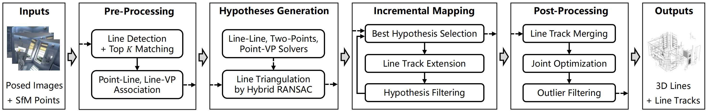

# IncreLM

Official implementation of paper "IncreLM: Incremental 3D Line Mapping" at BMVC 2024.

The code and a detailed README file will be available shortly.

**Pipeline.** Our system begins with feature pre-processing and 3D line segment hypotheses generation. It then incrementally produces 3D line segments and line tracks, one at a time. Finally, post-processing is conducted to enhance the overall quality of the mapping.
